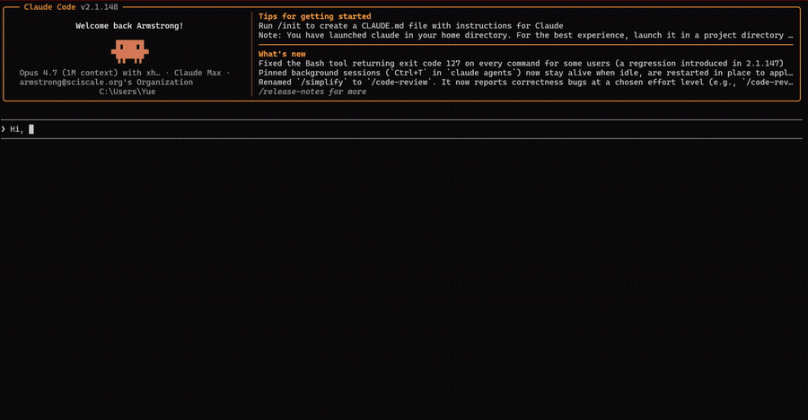
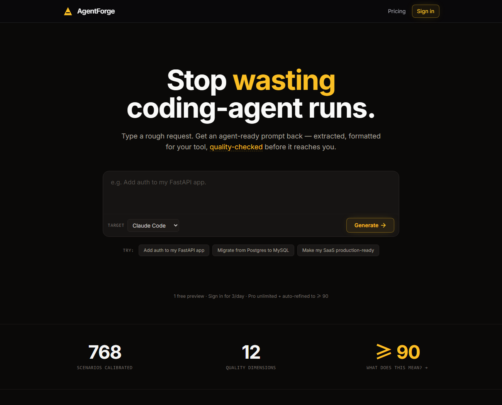
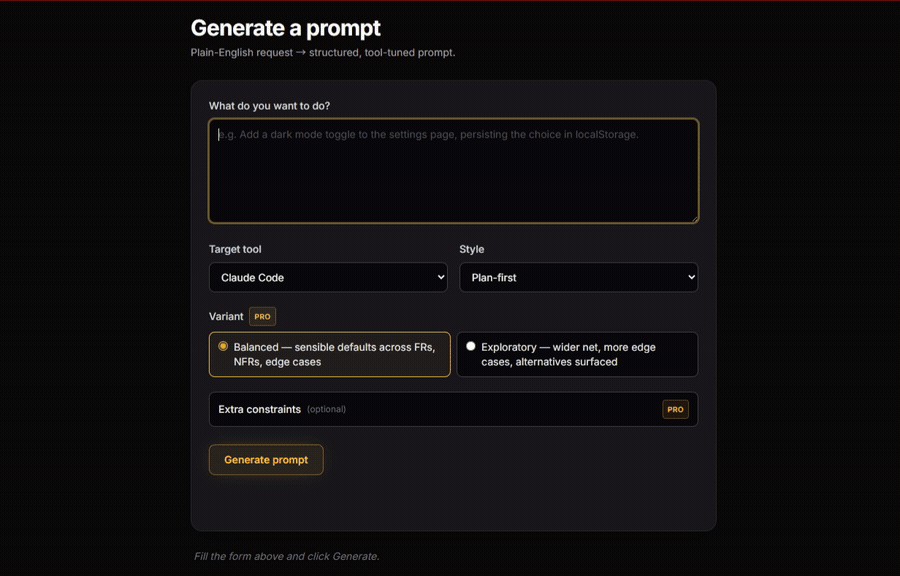
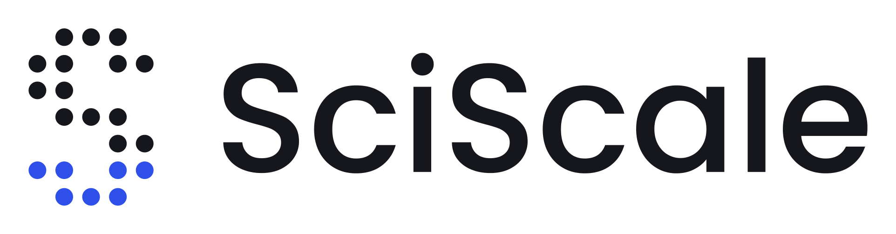

<div align="center">


# agentforge-mcp

**Stop re-explaining what you want to your AI coding agent.**<br/>
Hand it one rough sentence — get back a structured, tool-tuned prompt
it can execute in one pass.

[](https://www.npmjs.com/package/agentforge-mcp)
[](./LICENSE)

[**agentforge.sciscale.org**](https://agentforge.sciscale.org) · [Quick start](#quick-start) · [npm](https://www.npmjs.com/package/agentforge-mcp)

</div>



`agentforge-mcp` is the [Model Context Protocol](https://modelcontextprotocol.io)
server for [AgentForge](https://agentforge.sciscale.org). One tool, one job: turn
a vague request into a sharp one.

## Why

You know the loop: you ask your coding agent for something, it misreads the half
you didn't spell out, you correct it, it breaks something else, you re-explain.
The fix isn't a smarter agent — it's a sharper *prompt*.

AgentForge does the prompt engineering for you. Give it
`"add a dark mode toggle that persists"` and it:

- **extracts the real requirements** — the edge cases, the acceptance criteria,
  the things you'd have forgotten to mention;
- **formats for your specific agent** — Claude Code wants file:line references,
  Cursor wants directives, Aider wants tight context;
- **quality-checks before returning** — every prompt is scored across 12
  dimensions, calibrated against 768 real software requests.

You get a prompt your agent runs once, instead of five times.

## Quick start

No install — it runs through `npx`.

**1. Get an API key.** Sign in at
[agentforge.sciscale.org](https://agentforge.sciscale.org), open **API keys**,
and create one. The key is shown once — copy it.

**2. Add it to your agent.**

Claude Code:

```sh
claude mcp add agentforge --env AGENTFORGE_API_KEY=af_your_key -- npx -y agentforge-mcp
```

Cursor / Windsurf / Claude Desktop — add to your MCP config
(`~/.cursor/mcp.json`, `~/.codeium/windsurf/mcp_config.json`, etc.):

```json
{
  "mcpServers": {
    "agentforge": {
      "command": "npx",
      "args": ["-y", "agentforge-mcp"],
      "env": { "AGENTFORGE_API_KEY": "af_your_key" }
    }
  }
}
```

**3. Use it.** Ask your agent naturally — *"refine this with AgentForge, then
build it: add a dark mode toggle that persists."*

## The tool — `agentforge_refine_prompt`

| Argument | Default | |
|---|---|---|
| `request` | — | Your task in plain language (1–4000 chars). Rough is fine. |
| `target_tool` | `claude-code` | `claude-code`, `codex`, `cursor`, `aider`, `continue`, `windsurf`, `kimi`, `generic` |
| `style` | `plan-first` | `plan-first`, `direct-edit`, `explore-first` |

Returns the refined prompt, plus its Quality Engine score and your remaining
daily usage.

## Free vs Pro

| | Free | Pro |
|---|---|---|
| Refinements | 3 / day | Unlimited |
| Quality Engine | scored across 12 dimensions | scored **+ auto-refined until it passes ≥ 90** |

## Or use the web app

Don't want to wire up an MCP server at all? The same engine — same Quality
Engine, same per-account Pro — runs right in your browser at
**[agentforge.sciscale.org](https://agentforge.sciscale.org)**. No install, no
key, no config.

[](https://agentforge.sciscale.org)

<div align="center">

### [→ Try it now at agentforge.sciscale.org](https://agentforge.sciscale.org)

</div>

Paste a request, pick your target tool, copy the prompt — generation history and
advanced modes included:



## How it works

`agentforge-mcp` is a thin client — no engine logic ships in this package. Your
request goes to the AgentForge API, the hosted engine does the extraction,
formatting, and quality-checking, and the prompt comes back. The engine keeps
improving without you ever updating this package.

## Configuration

| Variable | Default | |
|---|---|---|
| `AGENTFORGE_API_KEY` | — | **Required.** Your API key. |
| `AGENTFORGE_API_URL` | `https://agentforge.sciscale.org/api/v1/refine` | Override the endpoint (rarely needed). |

## Develop

```sh
npm install
npm run build      # tsc -> dist/
node dist/index.js # runs on stdio
```

## License

MIT — see [LICENSE](./LICENSE).

<br/>

<div align="center">

<a href="https://wow.sciscale.org">
  <picture>
    <source media="(prefers-color-scheme: dark)" srcset="assets/sciscale-white.png" />
    
  </picture>
</a>

<sub>**agentforge-mcp** is part of [AgentForge](https://agentforge.sciscale.org) — a [SciScale studio](https://wow.sciscale.org) product.</sub>

</div>
